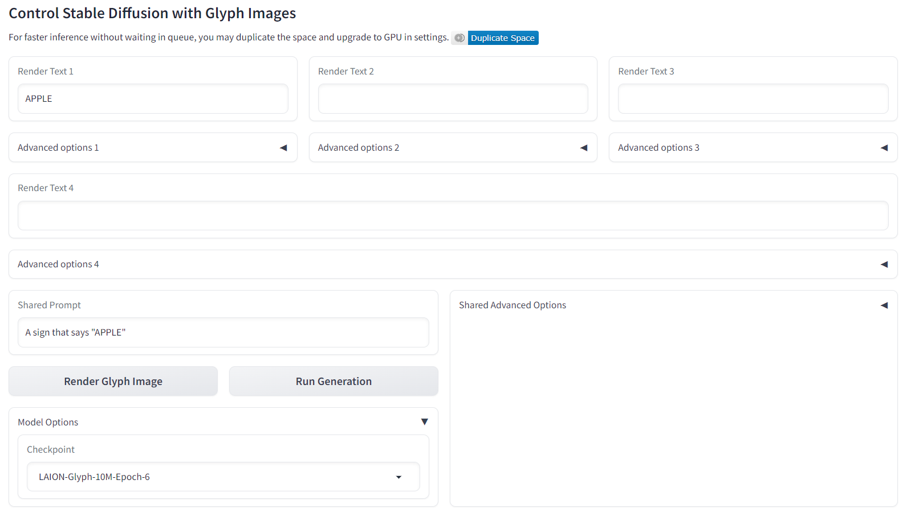

# GlyphControl: Glyph Conditional Control for Visual Text Generation 

<a href='https://arxiv.org/pdf/2305.18259'>
<a href='https://github.com/AIGText/GlyphControl-release'>
<a href='https://huggingface.co/spaces/AIGText/GlyphControl'></a> 

<div align="center">


</div>


## News

⛽ ⛽ ⛽ Contact: [yuhui.yuan@microsoft.com](yuhui.yuan@microsoft.com) 

**2024.02.12** Release the training/evaluation codes.

**2023.09.22** GlyphControl has been accepted by NeurIPS 2023 🍺

## :high_brightness: Highlights

* We propose a glyph-conditional text-to-image generation model named **GlyphControl** for visual text generation, which outperforms DeepFloyd IF and Stable Diffusion in terms of OCR accuracy and CLIP score while saving the number of parameters by more than 3×.

* We introduce a visual text generation benchmark named **LAION-Glyph** by filtering the LAION-2B-en and selecting the images with rich visual text content by using the modern OCR system. We conduct experiments on three different dataset scales: LAION-Glyph-100K,LAION-Glyph-1M, and LAION-Glyph-10M.

* We report **flexible** and **customized** visual text generation results. We empirically show that the users can control the content, locations, and sizes of generated visual text through the interface of glyph instructions.

<div align="center">


</div>

## :triangular_flag_on_post: Test Benchmark

* **SimpleBench**: A simple text prompt benchmark following the [Character-aware Paper](https://arxiv.org/abs/2212.10562). The format of prompts remains the same:  _`A sign that says "\<word>".'_
* **CreativeBench**: A creative text prompt benchmark adapted from [GlyphDraw](https://arxiv.org/abs/2303.17870). We adopt diverse English-version prompts in the original benchmark and replace the words inside quotes. As an example, the prompt may look like: _`Little panda holding a sign that says "\<word>".'_ or _'A photographer wears a t-shirt with the word "\<word>." printed on it.'_

Following [Character-aware Paper](https://arxiv.org/abs/2212.10562), we collect a pool of single-word candidates from Wikipedia. These words are
then categorized into **four** buckets based on their frequencies: top 1K, 1k to 10k, 10k to 100k, and 100k plus. Each bucket contains words with frequencies in the respective range. To form input
prompts, we randomly select **100** words from each bucket and insert them into the above
templates. We generate **four** images for each word during the evaluation process.

(The selected words are listed in the ```text_prompts/raw/SimpleBench``` folder while the candidate prompt templates of **CreativeBench** are shown in the ```text_prompts/raw/CreativeBench``` folder.

The full prompts related to the evaluation results shown in the paper could be found in the ```text_prompts/paper``` folder.
)

## :camera: Quantitative Results

We evaluate the OCR accuracy through three metrics, i.e., exact match accuracy $\bf{Acc}$, capitalization-insensitive exact match accuracy $\bf{\hat{Acc}}$, average Levenshtein distance $\bf{LD}$. Besids, we also assess the image-text alignment through **CLIP score**.

Method | #Params |Training Dataset  | $\bf{Acc}$ (%) $\uparrow$ | $\bf{\hat{Acc}}$ (%) $\uparrow$ |$\bf{LD}\downarrow$ | CLIP Score $\uparrow$ 
:--------- | :--------- | :--------| :---------: | :---------: | :---------: | :---------: |
Stable Diffusion v2.0 | 865M | LAION 1.2B  | $0/0$ | $3/2$ | $4.25/5.01$  | $31.6/33.8$ 
DeepFloyd (IF-I-M) | 2.1B | LAION 1.2B  | $0.3/0.1$ | $18/11$ |  $2.44/3.86$ | $32.8/34.3$  
DeepFloyd (IF-I-L)  | 2.6B | LAION 1.2B  | $0.3/0.7$ | $26/17$ |  $1.97/3.37$ | $33.1/34.9$ 
DeepFloyd (IF-I-XL)  | 6.0B | LAION 1.2B  | $0.6/1$ | $33/21$  | $1.63/3.09$ | $33.5/35.2$
GlyphControl | 1.3B | LAION-Glyph-100K  | $30/19$  |  $37/24$ | $1.77/2.58$ | $33.7/36.2$
GlyphControl | 1.3B |  LAION-Glyph-1M  | $40/26$ |  $45/30$ | $1.59/2.47$ | $33.4/36.0$ 
GlyphControl| 1.3B | LAION-Glyph-10M  | $\bf{42}/\bf{28}$ |  $\bf{48}/\bf{34}$ | $\bf{1.43}/\bf{2.40}$ | $\bf{33.9}/\bf{36.2}$

The results shown here are averaged over four word-frequency buckets. The results on **SimpleBench** / **CreativeBench** are presented on the left/right side of the slash, respectively. For all evaluated models, the global seed is set as 0 and no additional prompts are used while we take the empty string as the negative prompt for classifier-free guidance. 


## :wrench: Installation
Clone this repo: 
```
git clone https://github.com/AIGText/GlyphControl-release.git
cd GlyphControl-release
```

Install required Python packages

(Recommended)
```
conda env create -f environment.yaml
conda activate GlyphControl
```
or
```
conda create -n GlyphControl python=3.9
conda activate GlyphControl
pip install -r requirements.txt
```

Althoguh you could run our codes on CPU device,  we recommend you to use CUDA device for faster inference. The recommended CUDA version is **CUDA 11.3** and the minimum GPU memory consumption is 8~10G.

## :unlock: Available Checkpoints

Download the checkpoints from our [huggingface space](https://huggingface.co/spaces/AIGText/GlyphControl/tree/main/checkpoints) and put the corresponding checkpoint files into the ```checkpoints``` folder. 
We provide **four** types of checkpoints. 

Apart from the model trained on **LAION-Glyph-10M** for 6 epochs,  we also fine-tune the model for additional 40 epochs on **TextCaps-5K**, a subset of [TextCaps v0.1 Dataset](https://textvqa.org/textcaps/dataset/) consisting of 5K images related to signs, books, and posters.During the fine-tuning, we also train the U-Net decoder of the original SD branch according to the ablation study in our [paper](https://arxiv.org/pdf/2305.18259).

The relevant information is shown below. 

Checkpoint File | Training Dataset  | Trainig Epochs| $\bf{Acc}$ (%) $\uparrow$ | $\bf{\hat{Acc}}$ (%) $\uparrow$ |$\bf{LD}\downarrow$ | CLIP Score $\uparrow$ 
:--------- | :--------- | :--------:| :---------: | :---------: | :---------: | :---------: |
laion10M_epoch_6_model_ema_only.ckpt | LAION-Glyph-10M  | 6 | $\bf{42}/\bf{28}$ |  $\bf{48}/\bf{34}$ | $\bf{1.43}/\bf{2.40}$ | $\bf{33.9}/\bf{36.2}$ | 
textcaps5K_epoch_10_model_ema_only.ckpt | TextCaps 5K  | 10 | $58/30$  | $64/34$ | $1.01/2.40$ | $33.8/35.1$
textcaps5K_epoch_20_model_ema_only.ckpt | TextCaps 5K  | 20 | $57/32$  | $66/38$ | $0.97/2.26$ | $34.2/35.5$
textcaps5K_epoch_40_model_ema_only.ckpt | TextCaps 5K  | 40 | $\bf{71}/\bf{41}$ |  $\bf{77}/\bf{46}$ | $\bf{0.55}/\bf{1.67}$ | $\bf{34.2}/\bf{35.8}$ | 

Although the models fine-tuned on TextCaps 5K demonstrate high OCR accuracy, the creativity and diversity of generted images may be lost. Feel free to try all the provided checkpoints for comparison. All the checkpoints are ema-only checkpoints while ```use_ema``` in the configs/config.yaml should be set as ```False```.

## :triangular_flag_on_post:  Evaluation on Test Benchmarks.
We evaluate on two types of benchmarks ```SimpleBench``` and ```CreativeBench```. There are 4 text files in ```text_prompts/raw/SimpleBench```, each of which stores 100 words selected from a frequency bucket. 

For the ```SimpleBench```:

evaluating on multiple checkpoints at different epoches (DeepSpeed Strategy used for training)
```
- python test_on_benchmark.py --cfg configs/config_ema.yaml --ckpt_folder <folder_with_multiple_checkpoint> --spell_prompt_type 20 --from-file <txt_file_store_bucket_words> --save_path <save_path> --do_ocr_eval  --epoch_eval_start 0 --epoch_interval 1 --epoch_eval --grams 1 --deepspeed_ckpt --a_prompt "" --n_prompt ""    
```
on a single checkpoint:
```
- python test_on_benchmark.py --cfg configs/config_ema.yaml --ckpt <checkpoint_path> --spell_prompt_type 20 --from-file <txt_file_store_bucket_words> --save_path <save_path> --do_ocr_eval --grams 1 --deepspeed_ckpt --a_prompt "" --n_prompt ""   
```

You should use ```config_ema.yaml``` for the checkpoints with EMA parts, while for the **ema-only checkpoints** (like 4 released checkpoints in the [huggingface space](https://huggingface.co/spaces/AIGText/GlyphControl/tree/main/checkpoints)) or the checkpoints trained without ema , the ```config.yaml``` is needed. 

While for the ```CreativeBench```, you should add 
```
--prompt-from-file text_prompts/raw/CreativeBench/GlyphDraw_origin_remove_render_words.txt
```

## :mag_right: Glyph Instructions

* **Text character information**: GlyphControl allows for the specification of not only single words but also phrases or sentences composed of multiple words. As long as the text is intended to **be placed within the same area**, users can customize the text accordingly.

* **Text line information**: GlyphControl provides the flexibility to assign words to multiple lines by adjusting the **number of rows**. This feature enhances the visual effects and allows for more versatile text arrangements.

* **Text box information**: Users have control over the font size of the rendered text by modifying the **width** property of the text bounding box. The location of the text on the image can be specified using the **coordinates** of the top left corner. Additionally, the **yaw rotation angle** of the text box allows for further adjustments. By default, the text is rendered following the optimal width-height ratio, but users can define a specific width-height ratio to precisely control the height of the text box (not recommended).

Users should provide the above three types of glyph instructions for inference. 


## :wrench: Inference
To run inference code locally, you need specify the glyph instructions first in the file ```glyph_instructions.yaml```.

And then execute the code like this:
```
python inference.py --cfg configs/config.yaml --ckpt checkpoints/laion10M_epoch_6_model_ema_only.ckpt --save_path generated_images --glyph_instructions glyph_instructions.yaml --prompt <Prompt> --num_samples 4
```

If you do not want to generate visual text, you could remove the "--glyph_instructions" parameter in the command. You could also specify other parameters like ```a_prompt``` and ```n_prompt``` to monitor the generation process. Please see the codes for detailed descriptions.


## :open_hands: Demo (Recommend)
As an easier way to conduct trials on our models, you could test through a demo.

After downloading the checkpoints, execute the code:
```
python app.py
```
Then you could generate visual text through a local demo interface. 

Or you can directly try our **demo** in our **hugging face** space [GlyphControl](https://huggingface.co/spaces/AIGText/GlyphControl).




In the current version of our demo, we support four groups of ```Render Text``` at most.  Users should enter in the glyph instructions at corresponding parts. By selecting the checkpoint in the  ```Model Options``` part, users could try all four released checkpoints.

## :unlock: Training Dataset 

* **LAION-Glyph**: LAION-Glyph-1M or LAION-Glyph-10M 

(Please check ```data/README.md``` for more details)

* **TextCaps 5K**: seen in the appendix of the paper.

## :mag_right: Training 
**Recommended**: using the GPUs with the memory of 32GB (at least >16GB)

Download the pretrained model ```control_sd20_ini.ckpt``` from the [huggingface link](https://huggingface.co/spaces/AIGText/GlyphControl/blob/main/checkpoints/control_sd20_ini.ckpt) 
and put it into the folder ```pretrained_models```, 
and modify the ```batch_size``` in the training config to fit the GPU memory limit.

* Train the model on LAION-Glyph. 

First, prepare the ```data_info_file```, the tsv file recording the location of each sample (please check the template format in ```ldm/data/laion_glyph_control.py```.)

Run the code:
```
- python main.py --folder <data_folder> --laion_data_info <data_info_file> -t --logdir <local_log_dir> --mixed_precision false --scale_lr false --gpus <gpus> -b configs/train_configs/laion_glyph_glyphcontrol_train.yaml
```
The default logger is testtube logger. If you hope to use wandb logger, please provide wandb api key through the keyword parameter:
```
--wandb_key <wandb_api_key>
```
And you could also specify the experiment name through: 
<!-- (recommended when training on a multi-node cluster)  -->
```
--prefix <prefix_of_experiment> 
```

the sample code looks like: 
```
- python main.py --folder data/LAION-Glyph-10M --laion_ocr_info data/LAION-Glyph-10M/data_infos_10M.tsv -t --logdir logs/laion_glyphcontrol --mixed_precision false --scale_lr false --gpus 0,1,2,3,4,5,6,7 --strategy_type DeepSpeedStrategy -b configs/train_configs/laion_glyph_glyphcontrol_train.yaml --wandb_key <wandb_api_key>
```   

* Train (fine-tune) the model on TextCaps 5K: 
run the code:
```
- python main.py --folder <img_data_folder> --textcaps_caption <caption_data_file> --textcaps_hint_folder <glyph_img_folder> --textcaps_ocr_file <ocr_data_file> -t --logdir <logdir_in_blob> --mixed_precision false --scale_lr false --gpus <gpus>  -b configs/train_configs/textcaps_glyphcontrol_ablation.yaml --strategy_type DDPStrategy 
```

## :e-mail: Contact

For help or issues about the github codes or huggingface demo of GlyphControl, please email Yukang Yang (yyk19@tsinghua.org.cn), Dongnan Gui (gdn2001@mail.ustc.edu.cn), and Yuhui Yuan (yuhui.yuan@microsoft.com) or submit a GitHub issue.


## :mailbox_with_mail: Citation
If you find this code useful in your research, please consider citing:
```
@article{yang2024glyphcontrol,
  title={Glyphcontrol: Glyph conditional control for visual text generation},
  author={Yang, Yukang and Gui, Dongnan and Yuan, Yuhui and Liang, Weicong and Ding, Haisong and Hu, Han and Chen, Kai},
  journal={Advances in Neural Information Processing Systems},
  volume={36},
  year={2024}
}

```
